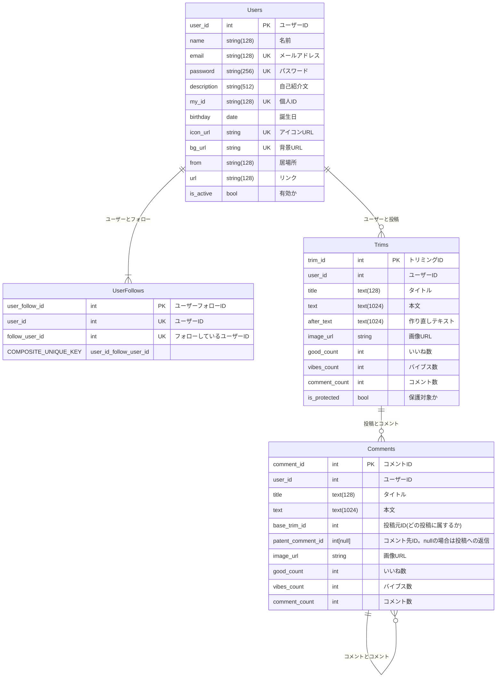

```mermaid
erDiagram
    Users||--|{UserFollows : "ユーザーとフォロー"
    Users||--o{Trims : "ユーザーと投稿"
    Trims||--o{Comments : "投稿とコメント"
    Comments||--o{Comments : "コメントとコメント"


    Users {
        user_id int PK "ユーザーID"
        name string(128) "名前"
        email string(128) UK "メールアドレス"
        password string(256) UK "パスワード"
        description string(512) "自己紹介文"
        my_id string(128) UK "個人ID"
        birthday date "誕生日"
        icon_url string UK "アイコンURL"
        bg_url string UK "背景URL"
        from string(128) "居場所"
        url string(128) "リンク"
        is_active bool "有効か"
    }

    UserFollows {
        user_follow_id int PK "ユーザーフォローID"
        user_id int UK "ユーザーID"
        follow_user_id int UK "フォローしているユーザーID"
        COMPOSITE_UNIQUE_KEY user_id_follow_user_id
    }

    Trims {
        trim_id int PK "トリミングID"
        user_id int "ユーザーID"
        title text(128) "タイトル"
        text text(1024) "本文"
        after_text text(1024) "作り直しテキスト"
        image_url string "画像URL"
        good_count int "いいね数"
        vibes_count int "バイブス数"
        comment_count int "コメント数"
        is_protected bool "保護対象か"
    }

    Comments {
        comment_id int PK "コメントID"
        user_id int "ユーザーID"
        title text(128) "タイトル"
        text text(1024) "本文"
        base_trim_id int "投稿元ID(どの投稿に属するか)"
        patent_comment_id int[null] "コメント先ID。nullの場合は投稿への返信"
        image_url string "画像URL"
        good_count int "いいね数"
        vibes_count int "バイブス数"
        comment_count int "コメント数"
    }

```
